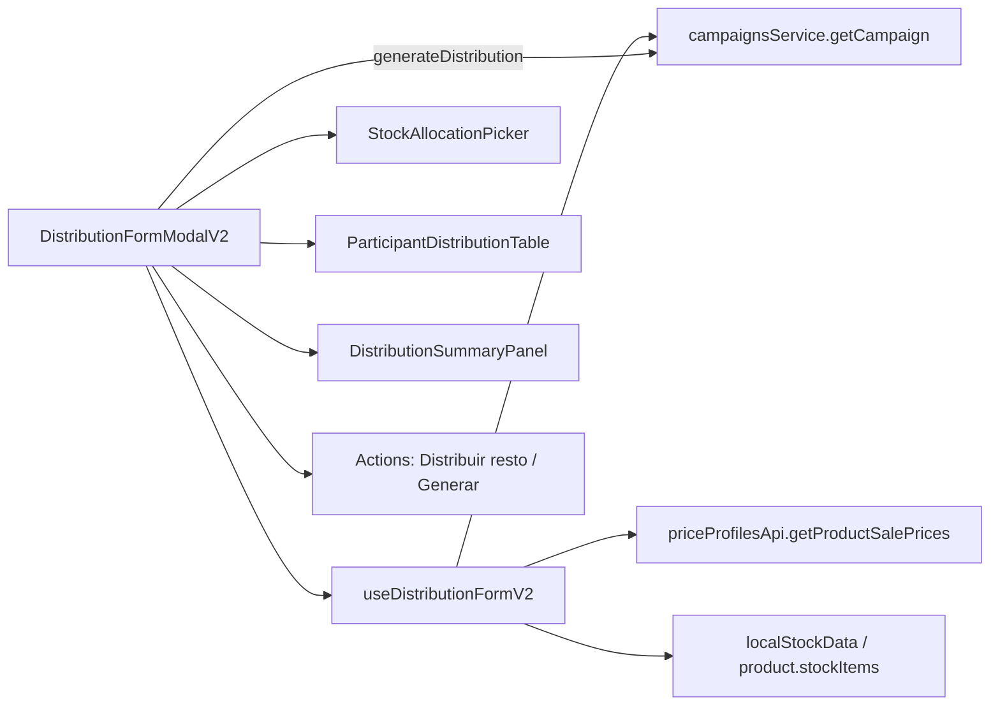

<!--firebender-plan
name: distribution-form-modal-v2
overview: Crear un nuevo modal `DistributionFormModalV2` que reemplaza al actual modal de generar reparto, con edición por cajas/medias/unidades por sede, monto esperado basado en precio de venta del perfil del participante, redistribución del remanente proporcional al monto esperado mediante un botón explícito, y paneles de costo/utilidad/venta por sede.
todos:
  - id: scaffold
    content: "Crear carpeta distribution-form-v2 con types.ts, useDistributionFormV2.ts y los 3 sub-componentes vacíos."
  - id: hook-state
    content: "Implementar estado base del hook: stockAllocations, participantRows, mode (units/box), allowHalfBox, presentationId, distributionType, selectedParticipants."
  - id: hook-prices
    content: "Cargar precios via priceProfilesApi.getProductSalePrices, mapear por participante usando priceProfileId y presentación base; marcar hasPriceWarning si no hay."
  - id: hook-derived
    content: "Helpers de derivados por fila: quantityBase, realSale, totalCost, profit; helper para explotar quantityBase -> boxes/halfBoxes/loose según factor y allowHalfBox."
  - id: hook-distribute-rest
    content: "autoDistributeRest(): reparte (totalAlloc - lockedSum) entre INTERNAL_SITE de la empresa actual (selectedCompany.id) no bloqueadas, proporcional a expectedAmountCents (largest-remainder) y re-explota en cajas/medias/unidades. Se dispara automaticamente (debounced) en cada edicion."
  - id: hook-sale-validator
    content: "Helper saleStatus(realSale, expected) -> 'ok' | 'warn' | 'bad' usado por filas y total para el badge visual."
  - id: hook-validate-submit
    content: "validate() + submit() construyendo distributions[] con sources (pool greedy) y mandando presentationId/quantityPresentation/factorToBase cuando aplica."
  - id: ui-stock-picker
    content: "StockAllocationPicker.tsx: checkboxes + inputs por almacen/area, filtrando ESTRICTAMENTE por selectedSite.id (sin fallback). Warning bloqueante si vacio."
  - id: ui-table
    content: "ParticipantDistributionTable.tsx: filas agrupadas (sedes propias / externas y otras), inputs cajas/medias/unidades, columnas precio/venta esperada/venta real + badge Δ/costo/utilidad y botón lock."
  - id: ui-summary
    content: "DistributionSummaryPanel.tsx: totales con badge Δ global venta vs esperado, boton 'Recalcular resto'."
  - id: modal-shell
    content: "DistributionFormModalV2.tsx: layout, header, secciones tipo de reparto + stock + modo + tabla + resumen + acciones; mismo prop signature que el modal actual."
  - id: wire-banner
    content: "Cambiar import en CampaignProductBannerModal.tsx (líneas 24 y 1371) para usar DistributionFormModalV2."
  - id: validate
    content: "Correr typecheck y lint (/validate)."
-->

# Plan: Distribution Form Modal V2

## Objetivo
Reemplazar el actual `DistributionFormModal.tsx` (3166 líneas) con una versión nueva más robusta, dinámica y profesional, que permita gestionar repartos, costos, ventas y utilidad por sede.

## Decisiones acordadas
- **Media caja**: solo se habilita si `factorToBase` es par; equivale a `factor/2`.
- **Stock**: SOLO se puede seleccionar/agregar stock de la **sede actual** (`useTenantStore.selectedSite.id`). Stocks de otras sedes ni se muestran (sin fallback). Si la sede actual no tiene stock se muestra un warning y se bloquea la generación.
- **Remanente**: la redistribución es **automática** mientras se edita. Cada vez que el usuario cambia cajas/medias/unidades o bloquea una fila, el restante = `totalFromAllocations - sum(lockedRows)` se reparte automáticamente entre las **sedes internas de la empresa actual** no bloqueadas, proporcional a su **monto esperado** (assignedAmountCents). Solo se mantiene un botón secundario "Recalcular" para reaplicarlo on-demand.
- **Filtro de sedes para el resto**: las filas elegibles para absorber el remanente son INTERNAL_SITE cuyo `site.companyId` coincide con `useTenantStore.selectedCompany.id` (empresa actual del login). Empresas externas y sedes de otras empresas NO reciben el resto automáticamente; pueden recibir cantidades solo manualmente.
- **Alcance**: nuevo archivo `DistributionFormModalV2.tsx` y reemplazar el import en `CampaignProductBannerModal.tsx`. El modal viejo se mantiene en disco temporalmente.
- **Precio**: siempre **por unidad** (`precioUnit = priceCents(perfil del participante, presentación base) / 100`). Si no hay precio cargado para el perfil/producto → precio = 0 y la fila se marca con warning, pero no bloquea.
- **Validador venta vs esperado**: en cada fila y en el total se compara `realSaleCents` con `expectedAmountCents` y se muestra un badge visual de color (verde si ±2%, ámbar si ±10%, rojo si fuera de rango) con la diferencia en monto y %.
- **Columnas por sede**: cajas / medias / unidades sueltas (todos editables) + precio unit + venta esperada + venta real + badge Δ + costo + utilidad + lock.

## Arquitectura



## Archivos a crear

- **[src/components/Campaigns/DistributionFormModalV2.tsx](src/components/Campaigns/DistributionFormModalV2.tsx)** — modal principal (UI). Mantiene la misma API pública que el actual (`visible`, `campaignId`, `product`, `localStockData`, `onClose`, `onSuccess`, `asContent`).
- **[src/components/Campaigns/distribution-form-v2/useDistributionFormV2.ts](src/components/Campaigns/distribution-form-v2/useDistributionFormV2.ts)** — hook con todo el estado y cálculos (allocations de stock, tabla de participantes, precios, lock, distribuir-resto, payload de envío).
- **[src/components/Campaigns/distribution-form-v2/types.ts](src/components/Campaigns/distribution-form-v2/types.ts)** — tipos locales `ParticipantRowV2`, `StockBucket`, `DistributionMode`, etc.
- **[src/components/Campaigns/distribution-form-v2/ParticipantDistributionTable.tsx](src/components/Campaigns/distribution-form-v2/ParticipantDistributionTable.tsx)** — tabla con filas editables (cajas/medias/unidades, precio, venta, costo, utilidad, lock).
- **[src/components/Campaigns/distribution-form-v2/DistributionSummaryPanel.tsx](src/components/Campaigns/distribution-form-v2/DistributionSummaryPanel.tsx)** — totales: cantidad, venta esperada, venta real, costo, utilidad, margen %.
- **[src/components/Campaigns/distribution-form-v2/StockAllocationPicker.tsx](src/components/Campaigns/distribution-form-v2/StockAllocationPicker.tsx)** — checkboxes + cantidad por almacén/área (porteado del actual).

## Archivos a modificar

- **[src/components/Campaigns/CampaignProductBannerModal.tsx](src/components/Campaigns/CampaignProductBannerModal.tsx)** (línea 24 y 1371) — cambiar import a `DistributionFormModalV2`. Es el único punto de uso.

## Modelo de datos por fila (clave del hook)

```ts
type ParticipantRowV2 = {
  participantId: string;
  participantName: string;
  participantType: 'INTERNAL_SITE' | 'EXTERNAL_COMPANY';
  // Cantidades editables (siempre se persiste en base)
  boxes: number;          // cajas (factor)
  halfBoxes: number;      // medias (solo si factor par)
  loose: number;          // unidades sueltas
  // Derivados
  quantityBase: number;   // boxes*factor + halfBoxes*(factor/2) + loose
  // Precios
  unitPriceCents: number; // del perfil del participante, presentación base
  unitCostCents: number;  // product.costCents
  expectedAmountCents: number; // assignedAmountCents del participante (lo "comprometido")
  // Calculados
  realSaleCents: number;  // unitPrice * quantityBase
  totalCostCents: number; // unitCost * quantityBase
  profitCents: number;    // realSale - totalCost
  // UX
  locked: boolean;        // si true: NO lo toca "Distribuir resto"
  hasPriceWarning: boolean;
};
```

## Lógica clave del hook

- **Sede actual**: leer `useTenantStore.selectedSite.id` y `useTenantStore.selectedCompany.id`. El `StockAllocationPicker` filtra **estrictamente** por `stock.siteId === selectedSite.id`. Sin fallback al ver "todos los stocks". Si la lista queda vacía → warning bloqueante en la sección de stock.
- **Cálculo de precio por participante**: al cargar, hacer `priceProfilesApi.getProductSalePrices(productId)` y para cada participante buscar el `ProductSalePrice` donde `profileId === participant.priceProfileId` y `presentationId === null` (presentación base). Si no existe, `unitPriceCents = 0` y `hasPriceWarning = true`.
- **Edición**: cualquier cambio en `boxes/halfBoxes/loose` recalcula `quantityBase` y los derivados. Tras cada edición se dispara **automáticamente** `autoDistributeRest()` (debounced ~150 ms para no pelear con el typing) que reparte el sobrante entre sedes internas no bloqueadas. Si `factor` es impar, el campo "Medias" queda oculto/disabled.
- **Lock**: candado por fila. Cuando está activo, `autoDistributeRest()` lo ignora y su valor queda congelado. Para una fila marcada manualmente sin candado, también queda fija pero puede ser modificada por el botón "Recalcular" o por un nuevo cambio del usuario.
- **`autoDistributeRest()`**:
  1. `restante = totalFromAllocations - sum(quantityBase de filas bloqueadas y de filas externas con valor manual)`.
  2. **Filas elegibles**: solo participantes `INTERNAL_SITE` cuyo `site.companyId === selectedCompany.id` y no bloqueadas.
  3. Para cada elegible: peso = `expectedAmountCents`. Se reparten `restante` unidades base proporcional al peso (largest remainder para residuo).
  4. La distribución se re-explota a `boxes/halfBoxes/loose` según el modo: en modo "presentación" `boxes = floor(qty/factor)`, `loose = qty % factor`; si `allowHalfBox` y factor par, además `halfBoxes = floor(loose/(factor/2))`.
  5. Si `restante < 0` (el usuario distribuyó manualmente más de lo disponible) → no se recalcula y se muestra alerta en el resumen.
- **Validadores visuales venta vs esperado**:
  - Por fila: badge con `Δ = realSaleCents - expectedAmountCents` y `% = Δ / expectedAmountCents`. Color verde `|%| ≤ 2`, ámbar `≤ 10`, rojo `> 10` o `sin precio`.
  - Total: mismo badge sumando todas las filas; en el panel resumen y junto al botón Generar.
- **Validaciones de envío**: bloqueo si `sum(quantityBase) !== totalFromAllocations`, si hay stock pero no se seleccionó nada, o si el total de venta real está fuera de rango "rojo" (con confirm "Continuar igual"). 
- **Payload**: idéntico al actual (`campaignsService.generateDistribution` con `distributions[]` que llevan `participantId`, `quantityBase`, `sources`, opcionalmente `presentationId/quantityPresentation/factorToBase`). Si una fila tiene `boxes > 0 || halfBoxes > 0`, mandamos `presentationId` de la presentación seleccionada y `quantityPresentation = boxes + halfBoxes * 0.5` (o sólo `boxes` si no usa medias). Confirmar contrato del backend en runtime — si no acepta decimales, mandamos sólo `quantityBase` y dejamos la UI como interna.

## UI (resumen visual)

1. **Header**: nombre del producto + estado.
2. **Sección "Tipo de Reparto"** (radio): Internos / Internos+Externos / Custom (ya existente).
3. **Sección "Stock"** (`StockAllocationPicker`): checkboxes + input por almacén/área. Muestra "Total a repartir".
4. **Sección "Modo y presentación"**: tabs Unidades / Por Caja. Si tab "Por Caja" y `factor par`, aparece switch "Permitir media caja".
5. **Tabla de participantes** con columnas: Sede | Cajas | Medias | Unidades | Total | Precio U. | Venta esp. | Venta real | **Δ (badge)** | Costo | Utilidad | 🔒. Las filas de sedes de la empresa actual aparecen primero y con un chip "Sede propia"; las externas y otras empresas se muestran abajo en un grupo aparte (no participan del auto-reparto).
6. **Resumen global**: cantidad total, venta esperada (Σ expected), venta real (Σ realSale) + **badge Δ global**, costo (Σ totalCost), utilidad, margen %, diferencia stock vs distribuido.
7. **Acciones**: `Recalcular resto` (manual fallback), `Reset`, `Generar reparto`.

## Todos

(ver lista)

## Notas

- El modal viejo (`DistributionFormModal.tsx`) NO se borra en esta iteración; se desconecta. Una vez validado en QA se elimina en una segunda PR.
- No se cambia el contrato HTTP de `generateDistribution`. Si en pruebas se ve que el backend no acepta `quantityPresentation` decimal por "media caja", caemos al envío en `quantityBase` puro (la UI sigue mostrando cajas/medias para el usuario).
- Cross-platform: usar `design-system/tokens` (colors, spacing) — sin valores hardcodeados. Compatible web + nativo via `Platform.OS` cuando sea necesario.
