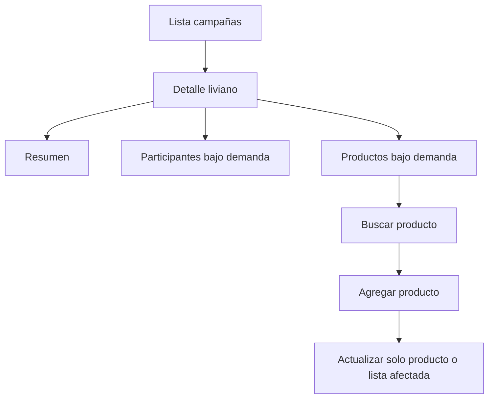

<!--firebender-plan
name: Mejoras Campañas
overview: Mejorar el módulo de campañas enfocándose en bugs/refactor, carga más rápida y UI más clara, sin cambios disruptivos del flujo actual. También dejar preparada una integración opcional de endpoints backend más eficientes si están disponibles o se agregan luego.
todos:
  - id: fix-campaign-hooks
    content: "Corregir inconsistencias entre hooks y servicio de campañas"
  - id: optimize-detail-load
    content: "Optimizar carga y recargas en CampaignDetailScreen"
  - id: improve-campaign-ui
    content: "Mejorar estados visuales, mensajes y textos del detalle"
  - id: optimize-add-product
    content: "Optimizar carga y UI en AddProductScreen"
  - id: backend-fallbacks
    content: "Preparar métodos opcionales para endpoints backend rápidos con fallback"
  - id: validate
    content: "Ejecutar typecheck/lint y corregir errores introducidos"
-->

# Plan de mejoras del módulo campañas

## Alcance
- Prioridad: **refactor/bugs + mejora de carga y UI**.
- No se cambiará el flujo principal de negocio; se reducirá carga innecesaria y se pulirán estados visuales.
- Se integrarán endpoints backend nuevos solo si ya existen o mediante fallback seguro a los endpoints actuales.

## Cambios propuestos
- **Corregir bugs de servicio/hooks** en [`src/hooks/api/useCampaigns.ts`](src/hooks/api/useCampaigns.ts) y [`src/services/api/campaigns.ts`](src/services/api/campaigns.ts):
  - Alinear `removeParticipant/removeProduct` con los métodos reales `deleteParticipant/deleteProduct`.
  - Corregir firmas de `useDistributionPreview` y `useGenerateDistribution`, porque hoy el hook pasa parámetros incompatibles con el servicio que espera `campaignId`, `productId` y `data`.
  - Mejorar tipados donde hoy hay `any` en respuestas de participantes/productos de campaña, sin hacer un refactor masivo.

- **Optimizar carga de `CampaignDetailScreen`** en [`src/screens/Campaigns/CampaignDetailScreen.tsx`](src/screens/Campaigns/CampaignDetailScreen.tsx):
  - Evitar cargas pesadas al abrir la pantalla si no son necesarias para la pestaña actual.
  - Mover carga de precios/stock/búsqueda global a demanda, especialmente cuando el usuario entra a “Productos” o empieza a buscar.
  - Evitar llamadas duplicadas al volver desde pantallas hijas, manteniendo la actualización puntual de producto que ya existe.
  - Reducir ruido de `console.log`/logs con caracteres dañados y usar `logger` de forma consistente.

- **Mejorar UI/UX del detalle de campaña**:
  - Añadir estados claros de carga por sección: resumen, participantes, productos, búsqueda y guardado.
  - Mejorar mensajes vacíos y errores recuperables sin mandar siempre al usuario hacia atrás.
  - Mantener “cargar más productos”, pero hacerlo más claro y resetearlo correctamente al cambiar filtros/búsqueda.
  - Pulir textos con encoding roto como `Éxito`, `¿`, etc.

- **Optimizar `AddProductScreen`** en [`src/screens/Campaigns/AddProductScreen.tsx`](src/screens/Campaigns/AddProductScreen.tsx):
  - Evitar recargar campaña y datos completos cada vez que cambia `sourceType` si solo se necesita conocer productos ya agregados.
  - Reutilizar búsqueda bajo demanda y stock disponible cuando el backend ya lo devuelve.
  - Mejorar los estados de carga para inventario, compras y recepciones por separado.

- **Preparar endpoints backend opcionales para carga rápida** en [`src/services/api/campaigns.ts`](src/services/api/campaigns.ts), con fallback:
  - `GET /admin/campaigns/:id/summary` para resumen liviano.
  - `GET /admin/campaigns/:id/products?page=&limit=&q=&distributionStatus=` para productos paginados/filtrados.
  - `GET /admin/campaigns/:id/participants?page=&limit=&q=` para participantes paginados/filtrados.
  - `POST /admin/campaigns/:id/products/prices/batch` o reutilizar batch existente para evitar N llamadas de precios.
  - Si estos endpoints no existen, el frontend seguirá usando `getCampaign` y los endpoints actuales.

- **Validación**:
  - Ejecutar `npm run typecheck`.
  - Ejecutar `npm run lint` si los errores existentes no bloquean demasiado; en caso de errores previos, reportar cuáles son ajenos al cambio.

## Flujo esperado después

