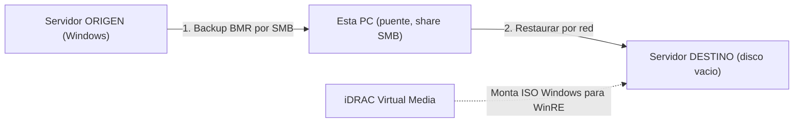

<!--firebender-plan
name: migracion-servidor-idrac
overview: Migrar un servidor Windows completo a un servidor nuevo (hardware mejor, disco vacío) usando esta PC como puente, vía iDRAC Virtual Media (sin USB booteable) y transfiriendo por el switch compartido. Método primario: Windows Server Backup (Bare Metal Recovery), tolerante a hardware distinto; alternativa: clon exacto con Clonezilla.
todos:
  - id: fase0-verificacion
    content: "Identificar versión exacta de Windows Server del origen, conseguir su ISO; confirmar modo UEFI/Legacy y esquema GPT/MBR; configurar destino igual en BIOS/iDRAC; crear disco virtual en la controladora RAID del destino; verificar que las NIC de datos de ambos servidores estan en el switch."
  - id: fase1-puente
    content: "Crear carpeta compartida SMB en esta PC con espacio suficiente y verificar acceso de ambos servidores por red."
  - id: fase2-backup-bmr
    content: "Instalar Windows Server Backup en el origen y ejecutar backup Bare Metal Recovery (-allCritical) hacia la share SMB de la PC puente; verificar integridad."
  - id: fase3-boot-idrac
    content: "Montar ISO de Windows en el destino via iDRAC Virtual Media, bootear y entrar a System Image Recovery / WinRE, conectar a la share de red."
  - id: fase4-restaurar
    content: "Restaurar la imagen BMR al disco del destino, inyectar drivers de almacenamiento si hace falta, primer arranque, instalar drivers del nuevo hardware, extender particion al disco mayor y validar."
  - id: fase5-cutover
    content: "Apagar origen, poner destino en IP/hostname de produccion, validar apps/datos/licencia, conservar backup, cambiar password iDRAC y desmontar Virtual Media."
  - id: alt-clonezilla
    content: "(Alternativa) Clon exacto con Clonezilla via iDRAC: imagen origen a la PC puente, restaurar al destino con resize, reparar boot de Windows e inyectar driver de controladora."
-->

# Migración de servidor Windows vía iDRAC (PC puente, sin USB)

## Escenario confirmado
- **Origen**: Windows Server, accesible por iDRAC, en el switch.
- **Destino**: hardware mejor, **disco vacío sin SO**, en el switch por iDRAC.
- **Puente**: esta PC (Windows) en el mismo switch, con espacio de sobra para alojar la imagen/backup.
- **Restricción**: sin USB booteable -> se reemplaza con **iDRAC Virtual Media** (monta una ISO por red como CD/USB booteable).
- **Meta**: que el destino arranque idéntico al origen.

> Nota de seguridad: compartiste la credencial del iDRAC en el chat. Cámbiala cuando termine la migración y evita reutilizarla. No la incluyo escrita en este plan.

## Flujo general

## Decisión de método
- **Primario (recomendado): Windows Server Backup -> Bare Metal Recovery (BMR).** Nativo, reconfigura drivers al restaurar, tolera hardware distinto y discos más grandes. Requiere la ISO de instalación de Windows Server de la MISMA versión/edición (se monta por iDRAC).
- **Alternativa: Clonezilla disco-a-disco** (clon exacto 1:1, incluye particiones no-Windows). Más frágil para arrancar en hardware distinto; requiere reparar boot/inyectar drivers después.

---

## Fase 0 — Preparación y verificación (ambos servidores)
1. **Identificar versión exacta de Windows Server** del origen (winver) y conseguir la **ISO de instalación correspondiente** (para WinRE de recuperaci��n). Sin esa ISO no se puede bootear la recuperación por iDRAC.
2. **Modo de arranque (UEFI vs BIOS Legacy)** y esquema de partición (GPT/MBR) del origen. El destino DEBE configurarse igual en su BIOS/iDRAC, o no arrancará.
3. **Controladora RAID/PERC en el destino**: crear el disco virtual (Virtual Disk) sobre los discos vacíos vía iDRAC o el config del controlador, del mismo tamaño o mayor que el usado en origen.
4. **Conectividad de la NIC de datos**: confirmar que la NIC del SO (no solo el puerto iDRAC) de ambos servidores llega al switch, porque el entorno de recuperación transfiere por esa NIC. Anotar IPs/plan de direccionamiento.
5. **Aviso de conflicto de identidad**: el clon conserva hostname, SID e IP del origen. NO dejar origen y destino encendidos a la vez en la red de producción para evitar IP/hostname/AD duplicados. El destino se enciende en producción solo cuando el origen esté apagado.

## Fase 1 — Preparar la PC puente (almacenamiento)
1. Crear una **carpeta compartida SMB** en esta PC (p. ej. `D:\migracion`) con permisos de escritura y credenciales conocidas; verificar espacio libre > datos usados del origen.
2. Confirmar que ambos servidores ven la share por red (firewall, SMB habilitado).

## Fase 2 — Backup del origen (método BMR)
1. En el origen (Windows en marcha): instalar la feature **Windows Server Backup** si falta.
2. Ejecutar un backup de **Bare Metal Recovery** (incluye estado del sistema + volúmenes de arranque) hacia la share SMB de la PC puente (`wbadmin start backup ... -allCritical -backupTarget:\\PCpuente\migracion`).
3. Verificar que el backup terminó sin errores y que el catálogo quedó accesible en la share.

## Fase 3 — Bootear recuperación en el destino vía iDRAC
1. En iDRAC del destino: **Virtual Console -> Virtual Media -> Map** la ISO de Windows Server (desde esta PC).
2. Setear **Boot Once = Virtual CD/DVD** y reiniciar el destino.
3. En el instalador: **Repair your computer -> Troubleshoot -> System Image Recovery** (o línea de comandos con `wbadmin`).
4. Conectar a la **share de red** (asignar IP si no hay DHCP) y seleccionar la imagen BMR de la PC puente.

## Fase 4 — Restaurar y arrancar
1. Restaurar la imagen al disco virtual del destino.
2. Si la controladora de disco difiere y la recuperación lo pide: **inyectar driver de almacenamiento** del nuevo hardware (Load Driver) o vía DISM offline.
3. Primer arranque: dejar que Windows redetecte hardware (NIC, chipset). Instalar drivers Dell del nuevo modelo.
4. **Extender la partición** para ocupar el disco mayor (Disk Management / `diskpart extend`).
5. Validaciones: arranque correcto, servicios/roles, conectividad, reactivación de licencia Windows si aplica.

## Fase 5 — Cierre y corte (cutover)
1. Apagar el origen antes de poner el destino en la IP/hostname de producción (evitar conflictos).
2. Verificar aplicaciones, datos y accesos en el destino.
3. Mantener el backup BMR en la PC puente como respaldo hasta validar todo.
4. Cambiar la contraseña del iDRAC y desmontar la Virtual Media.

---

## Alternativa B — Clon exacto con Clonezilla (si se prefiere 1:1)
1. Montar **ISO de Clonezilla** por iDRAC Virtual Media en el ORIGEN y bootear.
2. Modo `device-image`: guardar imagen del disco a la share/SSH de la PC puente.
3. Montar Clonezilla por iDRAC en el DESTINO, bootear y restaurar la imagen al disco vacío (usar opción de **resize/-k1** para disco mayor).
4. Reparar arranque de Windows: montar ISO de Windows por iDRAC -> WinRE -> `bootrec /fixboot /rebuildbcd` e inyectar driver de controladora si no bootea.
5. Extender partición y validar.

> Con ambos servidores online simultáneamente también es viable un clon disco-a-disco directo por red (Clonezilla lite-server/SSH) sin almacenar imagen intermedia; más rápido pero sin respaldo reutilizable.

## Riesgos clave a vigilar
- **No arranca tras restaurar**: casi siempre por driver de controladora de almacenamiento o mismatch UEFI/Legacy. Mitigado en Fase 0.3, 0.2 y 4.2.
- **Conflicto de identidad (IP/SID/hostname)** si ambos quedan vivos en red. Mitigado en Fase 0.5 y 5.1.
- **ISO de Windows incorrecta** (versión/edición distinta) impide WinRE coherente. Mitigado en Fase 0.1.
- **NIC de datos no conectada** (solo iDRAC en el switch): la recuperación no vería la share. Verificar en Fase 0.4.
