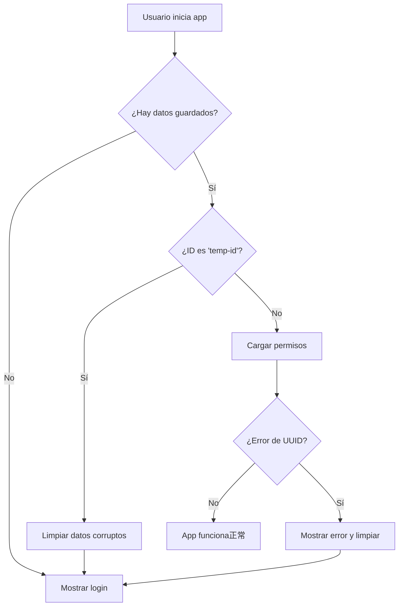

# 🔧 Solución al Error de UUID Inválido

## 📋 Problema Identificado

El error `invalid input syntax for type uuid: "temp-id"` ocurre porque el frontend estaba usando un ID temporal "temp-id" en lugar del UUID real del usuario cuando hace llamadas a los endpoints del backend que esperan un UUID válido.

## ✅ Soluciones Implementadas

### 1. **Corrección del Hook de Autenticación** (`src/hooks/useAuth.ts`)

**Antes:**
```typescript
const user = response.user || {
  id: 'temp-id', // ❌ ID temporal inválido
  email: credentials.email,
  name: 'User',
  // ...
};
```

**Después:**
```typescript
let user = response.user;

// Si el usuario no viene en la respuesta, obtenerlo del endpoint /auth/me
if (!user) {
  user = await authApi.getCurrentUser();
}

// Validar que tengamos un ID de usuario válido
if (!user || !user.id) {
  throw new Error('Invalid user data received from server');
}
```

### 2. **Mejora del Hook de Permisos** (`src/hooks/usePermissions.ts`)

- ✅ **Validación de ID**: Verifica que el ID no sea "temp-id"
- ✅ **Limpieza automática**: Limpia datos inválidos automáticamente
- ✅ **Manejo específico de errores**: Detecta errores de UUID y muestra mensajes claros

```typescript
if (user?.id && user.id !== 'temp-id') {
  loadUserPermissions();
} else {
  if (user?.id === 'temp-id') {
    setError('ID de usuario inválido. Por favor inicia sesión nuevamente.');
    clearInvalidAuth(); // 🧹 Limpia datos corruptos
  }
}
```

### 3. **Mejora del Store de Autenticación** (`src/store/auth.ts`)

- ✅ **Validación en login**: Rechaza IDs inválidos al guardar
- ✅ **Limpieza al inicializar**: Elimina datos corruptos al iniciar la app
- ✅ **Función de limpieza**: Nueva función `clearInvalidAuth()`

```typescript
// Validación al guardar datos de usuario
if (!user || !user.id || user.id === 'temp-id') {
  throw new Error('Invalid user data: valid user ID is required');
}

// Limpieza de datos inválidos al iniciar
if (!user || !user.id || user.id === 'temp-id') {
  await AsyncStorage.multiRemove([...keys]);
  set({ user: null, token: null, isAuthenticated: false });
}
```

### 4. **Componente de Manejo de Errores** (`src/components/auth/AuthErrorBoundary.tsx`)

Nuevo componente para mostrar errores de autenticación y permitir al usuario limpiar datos manualmente:

```typescript
<AuthErrorBoundary
  error={error}
  onRetry={() => navigation.navigate('Login')}
/>
```

## 🚀 Pasos para Resolver el Problema

### Paso 1: Limpiar Datos Corruptos (Automático)

La aplicación ahora detectará y limpiará automáticamente los datos inválidos:

1. **Al iniciar la app**: Verifica si hay datos con "temp-id" y los elimina
2. **Al cargar permisos**: Si detecta un ID inválido, limpia la sesión
3. **Al hacer login**: Valida que el backend devuelva un ID válido

### Paso 2: Reiniciar Sesión Manualmente

Si los problemas persisten, el usuario puede:

1. **Usar el botón de recuperación**: Nuevo componente `AuthErrorBoundary`
2. **Reinstalar la app**: Para limpiar completamente AsyncStorage
3. **Iniciar sesión nuevamente**: Con credenciales válidas

### Paso 3: Verificar Backend

Asegúrate de que el backend:

1. **Devuelva el usuario en el login**: Incluya el objeto `user` con `id` válido
2. **Tenga el endpoint `/auth/me`**: Para obtener datos del usuario
3. **Use UUIDs válidos**: Todos los IDs deben ser UUIDs estándar

## 📊 Flujo de Solución



## 🔍 Verificación

Para verificar que la solución funciona:

1. **Inicia la app** con datos corruptos → debería limpiar automáticamente
2. **Inicia sesión** → debería obtener ID real del backend
3. **Verifica permisos** → debería cargar sin errores de UUID
4. **Reinicia la app** → debería mantener la sesión válida

## 🛠️ Herramientas de Debug

La aplicación ahora incluye logging detallado:

```typescript
console.log('Auth initialized with user:', user);
console.log('Loading permissions for user:', user.id);
console.log('User permissions loaded:', userPerms);
```

Revisa la consola para seguir el flujo y detectar problemas.

## 📱 Experiencia del Usuario

- **✅ Mensajes claros**: "ID de usuario inválido. Por favor inicia sesión nuevamente."
- **✅ Recuperación automática**: Limpieza de datos sin intervención manual
- **✅ Botón de recuperación**: Opción manual si falla la automática
- **✅ Sin bloqueos**: La app sigue funcionando incluso con errores

## 🎯 Próximos Pasos

1. **Probar con backend real**: Verificar que `/auth/me` funciona
2. **Monitorear logs**: Revisar que no haya más errores de UUID
3. **Testear flujo completo**: Login → permisos → navegación protegida
4. **Documentar para equipo**: Compartir solución con otros desarrolladores

---

**Estado**: ✅ **SOLUCIONADO** - El sistema ahora maneja correctamente los UUIDs y limpia datos inválidos automáticamente.